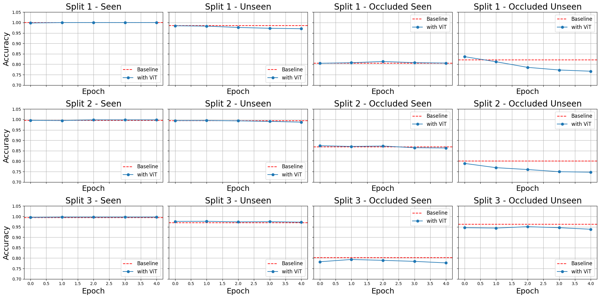

<div align="center">

# Using Vision Transformers to Improve the Aggregation of Diffusion Features for Object Pose Estimation

</div>

<div align="justify">
In this project, I aimed to improve upon the results of the paper titled "Object Pose Estimation via the Aggregation of Diffusion Features"(https://arxiv.org/abs/2403.18791), which implemented a template matching approach for object pose estimation. In their method, the authors compared features extracted from Stable Diffusion 1.5 for a reference image and its possible templates to identify the closest match, treating it as the estimated object pose. They developed three separate aggregation networks capable of performing a weighted average over the diffusion model’s features to generate a feature map that best represents the image or template. In my work, I integrated vision transformers into the architecture of the context-aware weight aggregator, with the aim of capturing global image details and enhancing the feature weighting process. An image of the modified architecture is shown below.
</div>

<p align="center">
  
</p>

<div align="justify">
I trained the model on data from LINEMOD and Occlusion LINEMOD for five epochs. Unfortunately, there was no improvement observed with this modified architecture. The results showed that the accuracy on seen and unseen LINEMOD objects and seen Occlusion LINEMOD was comparable to the baseline, but performance dropped for unseen Occlusion LINEMOD, with high standard deviation across all splits of the data. The graphs below show how the accuracy changed after every epoch.
</div>

<p align="center">
  
</p>

## Installation
<details><summary>Click to expand</summary>

### 1. Clone this repo.
```
git clone https://github.com/RyanV27/diffusion-object-pose.git
```
### 2. Install environments.
```
conda env create -f environment.yaml
conda activate diff-feats
```
</details>

## Data Preparation

<details><summary>Click to expand</summary>

### Final structure of folder dataset
```bash
./dataset
    ├── linemod 
        ├── models
        ├── opencv_pose
        ├── LINEMOD
        ├── occlusionLINEMOD
    ├── templates	
        ├── linemod
            ├── train
            ├── test
    ├── LINEMOD.json # query-template pairwise for LINEMOD
    ├── occlusionLINEMOD.json # query-template pairwise for Occlusion-LINEMOD
    └── crop_image512 # pre-cropped images for LINEMOD
```

### 1. Download datasets:
Download with following gdrive links and unzip them in ./dataset. I use the same data as [template-pose](https://github.com/nv-nguyen/template-pose).
- [LINEMOD and Occlusion-LINEMOD (3GB)](https://drive.google.com/file/d/1XkQBt01nlfCbFuBsPMfSHlcNIzShn7e7/view?usp=sharing)

### 2. Process ground-truth poses
Convert the coordinate system to [BOP datasets format](https://github.com/thodan/bop_toolkit/blob/master/docs/bop_datasets_format.md) and save GT poses of each object separately:
```bash
python -m data.process_gt_linemod
```
### 3. Render templates
To render templates:
```bash
python -m data.render_templates --dataset linemod --disable_output --num_workers 4
```
### 4. Crop images (only for LINEMOD)
Crop images of LINEMOD, OcclusionLINEMOD and its templates with GT poses:
```bash
python -m data.crop_image_linemod
```
### 5. Compute neighbors with GT poses
```bash
python -m data.create_dataframe_linemod
```

</details>

## Launch a training

<details><summary>Click to expand</summary>

### 1. Launch a training on LINEMOD
```bash
python train_linemod.py --config_path config_run/LM_Diffusion_$split_name.json
```

### 2. Launch a training on T-LESS
```bash
python train_tless.py --config_path ./config_run/TLESS_Diffusion.json
```

</details>

## Reproduce the results
<details><summary>Click to expand</summary>

### 1. Download checkpoints
You can download it from this [link](https://drive.google.com/drive/folders/1CVyW7IDAZ0uGZSJIoN3ARRyP_wY2Ntk9?usp=sharing).

### 2. Reproduce the results on LINEMOD
```bash
python test_linemod.py --config_path config_run/LM_Diffusion_$split_name.json --checkpoint checkpoint_path
```
</details>
